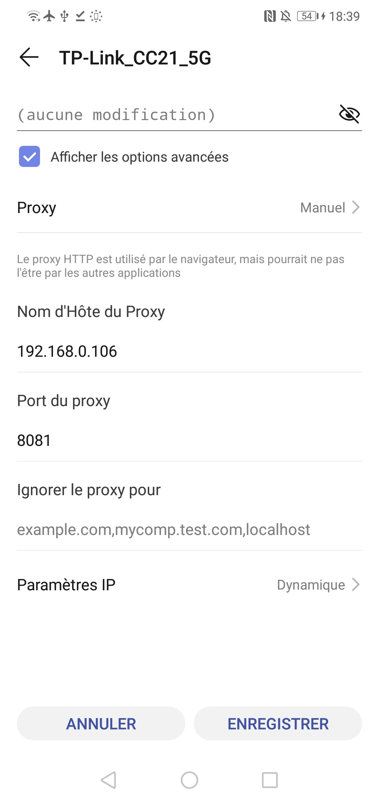
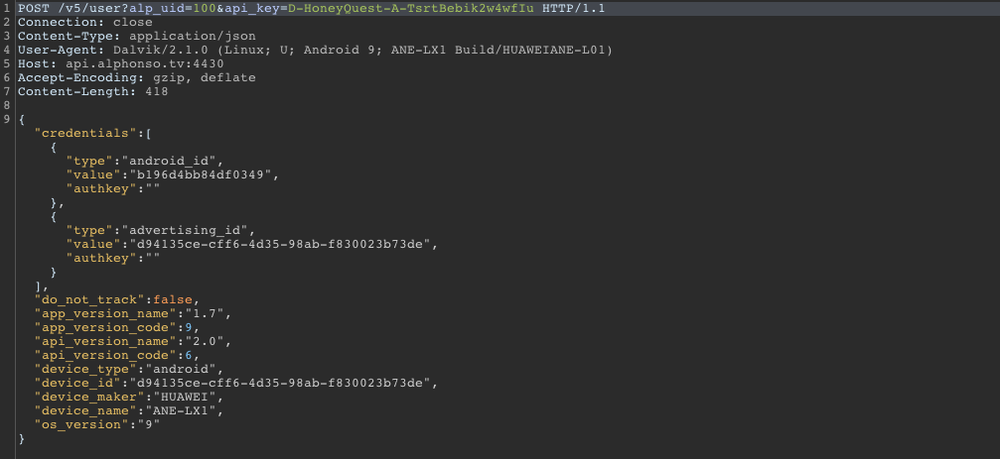
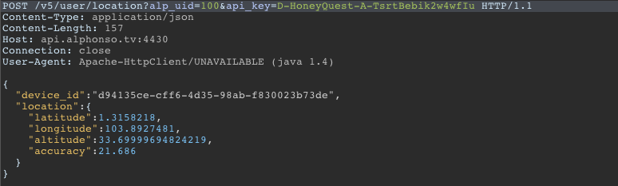
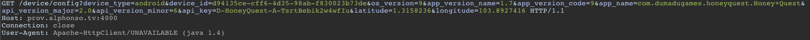
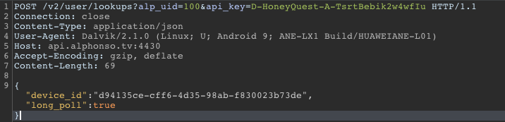
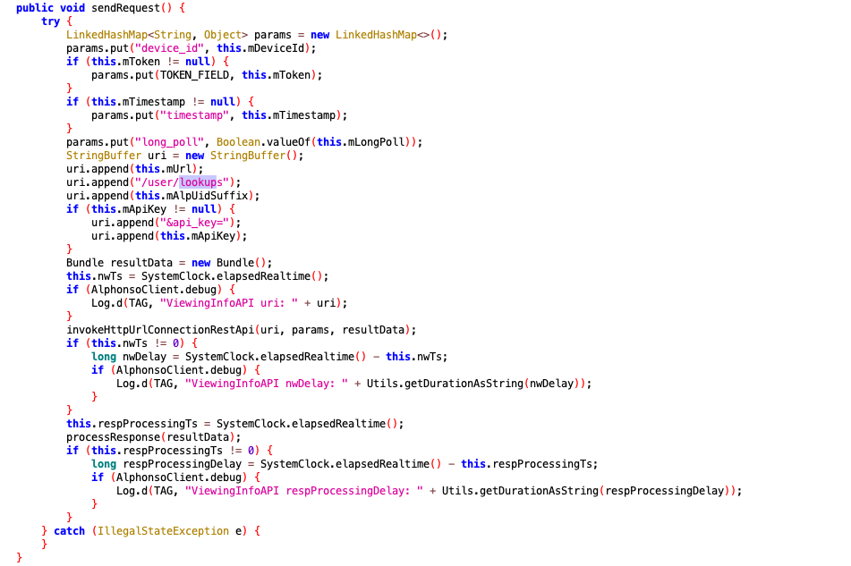
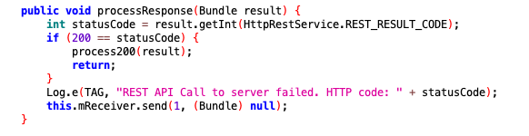
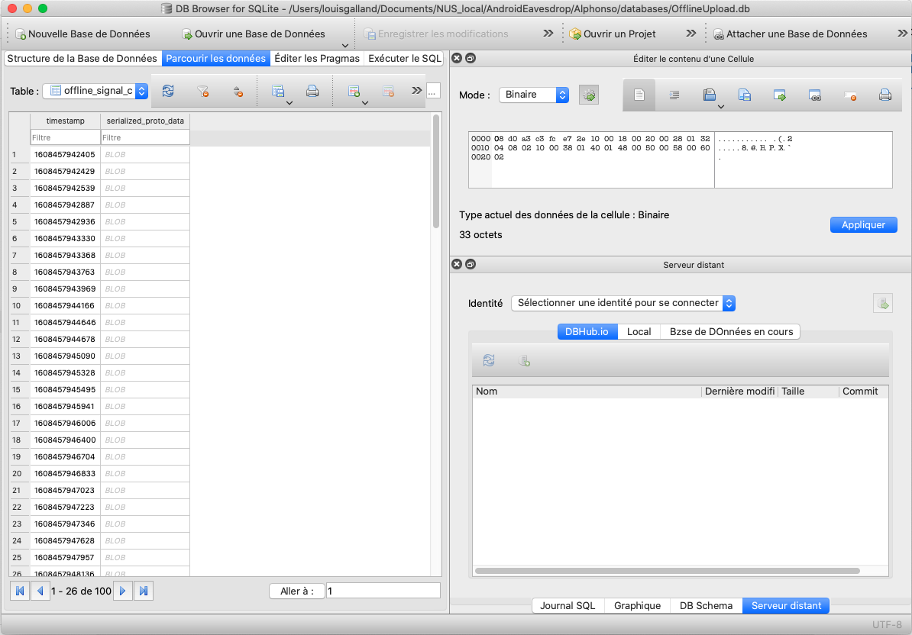
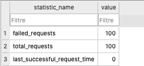

# Capture Traffic w/ Burp

<br/>

1. Create a listener on Burp Suite proxy.


<br/>

2. Connect to the proxy created by BURP, with the Android phone on the same network than the computer running Burp.




<br/>

3. Get the BURP certificate on http://burpsuite
   Indeed the proxy refuses HTTPS requests without the certificate
4. change the extension of the `cacert.der` certificate to `.cer`. Send it by email or push it on the phone storage. Automaticaly detected as a certificate when opening it on the device (contrary to the `.der` extension that would only work on iOS device and not on Huawei Android phones)

<br/>

<br/>

<br/>

<br/>

<br/>

<br/>


## Traffic captured by Burp Suite

Two hosts contacted: 

- api.alphonso.tv:4430
- prov.alphonso.tv:4000


It puts the user credentials in the URL requests:

- **alp_uid:** *100*

- **api_key:** 

  * *D-HoneyQuest-A-TsrtBebik2w4wfIu* 

  * *D-SlogCrkt-A-j82ZaR5HnNiBfbNa*  

    (remains the same after the app is relaunched), 

<br/>

<br/>

1. First **user lookups**: POST with device_id and long_poll=true
   **v2** sub-directory

   ```http
   POST /v2/user/lookups?alp_uid=100&api_key=D-SlogCrkt-A-j82ZaR5HnNiBfbNa HTTP/1.1
   Connection: close
   Content-Type: application/json
   User-Agent: Dalvik/2.1.0 (Linux; U; Android 9; ANE-LX1 Build/HUAWEIANE-L01)
   Host: api.alphonso.tv:4430
   Accept-Encoding: gzip, deflate
   Content-Length: 69
   {
   "device_id":"d94135ce-cff6-4d35-98ab-f830023b73de",
   "long_poll":true
   }
   ```

   

2. GET from prov.alphonso.tv: 
   Sends the *device type*, *devide_id, os_version, app_version_name, app_version_code, app_name, api_key, latitude, longitude*
   Receives *config_lease_time, id_service, save_n_clock_offset_values*

   ```http
   GET /device/config?device_type=android&device_id=d94135ce-cff6-4d35-98ab-f830023b73de&os_version=9&app_version_name=1.3&app_version_code=8&app_name=com.dumadugames.gp.slogcricket.Slog+Cricket&api_version_major=2.0&api_version_minor=6&api_key=D-SlogCrkt-A-j82ZaR5HnNiBfbNa&latitude=1.3158198595046997&longitude=103.89274597167969 HTTP/1.1
   Host: prov.alphonso.tv:4000
   Connection: close
   User-Agent: Apache-HttpClient/UNAVAILABLE (java 1.4)
   .
   .
   .
   #### RESPONSE ####
   .
   HTTP/1.1 200 OK
   X-Powered-By: Express
   Access-Control-Allow-Origin: *
   Vary: Origin, Accept-Encoding
   Content-Type: application/json
   Date: Sun, 20 Dec 2020 09:53:54 GMT
   Connection: close
   Content-Length: 92
   {
       "config_lease_time": 1800,
       "id_service": 99,
       "save_n_clock_offset_values": 5
   }
   ```

   

3. POST with user information (*android id, avertising id, device id...*)
   **v5** sub-directory

   ```http
   POST /v5/user?alp_uid=100&api_key=D-SlogCrkt-A-j82ZaR5HnNiBfbNa HTTP/1.1
   Connection: close
   Content-Type: application/json
   User-Agent: Dalvik/2.1.0 (Linux; U; Android 9; ANE-LX1 Build/HUAWEIANE-L01)
   Host: api.alphonso.tv:4430
   Accept-Encoding: gzip, deflate
   Content-Length: 418
   {
   "credentials":[
   	{"type":"android_id","value":"b196d4bb84df0349","authkey":""},
   	{"type":"advertising_id","value":"d94135ce-cff6-4d35-98ab-f830023b73de","authkey":""}],
   "do_not_track":false,
   "app_version_name":"1.3",
   "app_version_code":8,
   "api_version_name":"2.0",
   "api_version_code":6,
   "device_type":"android",
   "device_id":"d94135ce-cff6-4d35-98ab-f830023b73de",
   "device_maker":"HUAWEI",
   "device_name":"ANE-LX1",
   "os_version":"9"
   }
   ```

   

4. POST with user location (*latitude, longitude, altitude, accuracy*)
   **v5** sub-directory

   ```http
   POST /v5/user/location?alp_uid=100&api_key=D-SlogCrkt-A-j82ZaR5HnNiBfbNa HTTP/1.1
   Content-Type: application/json
   Content-Length: 169
   Host: api.alphonso.tv:4430
   Connection: close
   User-Agent: Apache-HttpClient/UNAVAILABLE (java 1.4)
   {
   "device_id":"d94135ce-cff6-4d35-98ab-f830023b73de",
   "location":{
   	"latitude":1.3158198595046997,
   	"longitude":103.89274597167969,
   	"altitude":33.69999694824219,
   	"accuracy":20}
   }
   ```


<br/>

<br/>

<br/>


## Appendices

<br/>

### POST v5/user

/user



<br/>

### POST v5/user/location

/user/location



<br/>

### GET /device/config from *prov.alphonso.tv*: 

Apache Service Unavailable




<br/>

### POST v2/user/lookups

Even works in background

4 POST requests per second. Even on background or screen locked. 




<br/>

<br/>

<br/>

This POST request does not manage to connect to Alphonso Server (see below, in **logcat** section).

This issue is caused in the class **`ViewingInfoApi`** of the package `alphonsoclient`. 



This class is expecting a response from the request (see below for the **logcat**). This response is never acquired.

<br/>

This is supposed to be returning a **"lookup object"**, containing info about what the user is watching on TV. 

<br/>

<br/>

<br/>

<br/>

<br/>

<br/>

<br/>

<br/>

<br/>


# Logcat

*Note:* logcats are at [logcat2_HoneyQuest](./Alphonso/logcat/logcat2_HoneyQuest),  [logcat1_slogcricket](Alphonso/logcat/logcat1_slogcricket)

The applications outputs logs using the tags:

- alphonso
- callback (error logs)
- tv.alphonso.service.**className**

```bash
adb logcat | grep "alphonso\|E callback" > logcatfile | cat 
```

<br/>

<br/>

<br/>

**FIRST LAUNCH**

``` 
29381 29381 E callback: Location Permission granted
29381 29381 E callback: Mic Permission granted
29381 29381 D tv.alphonso.service.client.AlphonsoServiceClient: appId: D-HoneyQuest-A-TsrtBebik2w4wfIuappname: Honey Quest
29381 29381 D tv.alphonso.service.client.ASClientFSM: Processing INIT event in tv.alphonso.service.client.ASClientNull state.
29381 29381 D tv.alphonso.utils.Utils: AppInfo in not null, name: .Honey Quest
29381 29381 D tv.alphonso.utils.Utils: label has only app-name.
29381 29381 E alphonso: Key usedD-HoneyQuest-A-TsrtBebik2w4wfIu
29381 29381 D tv.alphonso.service.client.ASClientFSM: Processing PROV_SERVER_PARAMS event in tv.alphonso.service.client.ASClientNull state.
29381 29381 D tv.alphonso.service.client.ASClientUtils: Binding to the AlphonsoService.
29381 29381 D tv.alphonso.service.client.ASClientUtils: No running instance of AlphonsoService, using this app's package: com.dumadugames.honeyquest
1265  6802 V ActivityManager: startProcess: name=tv.alphonso.service app=null knownToBeDead=true thread=null pid=-1
1265  1290 I ActivityManager: Start proc 29740:tv.alphonso.service/u0a158 for service com.dumadugames.honeyquest/tv.alphonso.service.AlphonsoService
```


**THE SERVICE IS STARTED**

``` 
29740 29740 D tv.alphonso.service.AlphonsoService: onCreate
29740 29753 I AwareBitmapCacher: init processName:tv.alphonso.service pid=29740 uid=10158
29740 29740 D tv.alphonso.service.AlphonsoService: onBind()
29381 29381 D tv.alphonso.service.client.ASClientFSM: Processing SERVICE_CONNECTION_UP event in tv.alphonso.service.client.ASClientInitInProgress state.
29381 29381 D tv.alphonso.service.client.ASClientInitInProgress: AlphonsoService connected!
29381 29381 D tv.alphonso.service.client.ASClientInitInProgress: Sending INIT message to AlphonsoService.
29740 29758 W AdvertisingIdClient: 	at tv.alphonso.service.AlphonsoService$1.run(AlphonsoService.java:197)
29740 29740 D tv.alphonso.alphonsoclient.AlphonsoClient: Alphonso Server Domain set as: http://api.alphonso.tv
29740 29740 D tv.alphonso.alphonsoclient.AlphonsoClient: Alphonso Server Port set as: 4430
29740 29740 D tv.alphonso.alphonsoclient.AlphonsoClient: Alphonso Server Domain SSL set as: 
29740 29740 D tv.alphonso.alphonsoclient.AlphonsoClient: Alphonso Server Port SSL set as: 
29740 29761 D tv.alphonso.alphonsoclient.AlphonsoClient: Alphonso Prov Server Domain set as: http://prov.alphonso.tv
29740 29761 D tv.alphonso.alphonsoclient.AlphonsoClient: Alphonso Prov Server Port set as: 4000
29740 29740 W tv.alphonso.service.ASFSM: Invalid Event: CLOCK_SYNC_CONFIG in state tv.alphonso.service.ASInitInProgress
29740 29762 D tv.alphonso.audiocaptureservice.FifoBuffer: setSizeLimit(): mSizeLimit: 64000; mCurrentPosition: 0
1265  1265 D HiDATA_HiStream: --->Intent received, action=huawei.media.AUDIO_RECORD_STATE_CHANGED_ACTION, packageName tv.alphonso.service,state3
29740 29761 E tv.alphonso.alphonsoclient.HttpRestService: HTTP SocketException, no presponse from server.
29740 29761 E tv.alphonso.alphonsoclient.AlphonsoClient: REST API Call to server failed with error 1002
29740 29740 E tv.alphonso.service.ProvClient: REST API call response is with error and code: 1
29740 29761 E tv.alphonso.alphonsoclient.RESTService: There was a problem when sending the request.
```

**REST SERVICE**

```
15405 15629 E tv.alphonso.alphonsoclient.RESTService: There was a problem when sending the request.
15405 15629 E tv.alphonso.alphonsoclient.RESTService: org.apache.http.conn.HttpHostConnectException: Connection to http://api.alphonso.tv:4430 refused
.......
.......
15405 15629 E tv.alphonso.alphonsoclient.RESTService: Caused by: java.net.ConnectException: failed to connect to /209.240.97.254 (port 4430) from /:: (port 33712): connect failed: ECONNREFUSED (Connection refused)
```

**INITIALIZATION SUCCESS **

``` 
15405 15629 E tv.alphonso.alphonsoclient.AlphonsoClient: REST API Call for Location update to server failed with error 0
15501 15501 D tv.alphonso.service.client.ASClientFSM: Processing INIT_RESPONSE event in tv.alphonso.service.client.ASClientInitInProgress state.
15501 15501 D tv.alphonso.service.client.ASClientInitInProgress: SUCCESS for INIT from AlphonsoService.
15501 15501 E callback: AlphonsoService initialization SUCCESS.
15501 15501 D tv.alphonso.service.client.ASClientFSM: Processing REGISTER_BCAST_RECEIVER event in tv.alphonso.service.client.ASClientInited state.
15501 15501 D tv.alphonso.service.client.ASClientUtils: Registered Bcast recevier.
15501 15501 D tv.alphonso.service.client.ASClientFSM: Processing START event in tv.alphonso.service.client.ASClientInited state.
15501 15501 D tv.alphonso.service.client.ASClientUtils: Sending START message to AlphonsoService.
15405 15632 E tv.alphonso.alphonsoclient.HttpRestService: HTTP SocketException, no presponse from server.
15405 15632 E tv.alphonso.alphonsoclient.ViewingInfoAPI: REST API Call to server failed. HTTP code: 1002
15405 15405 E tv.alphonso.service.AlphonsoService: Error response is with error code: 1


15405 15633 D tv.alphonso.audiocaptureservice.ACSPreBuffering: ACR is diabled, store the start event by setting the start-received flag
15405 15765 E tv.alphonso.alphonsoclient.HttpRestService: HTTP SocketException, no presponse from server.
15405 15765 E tv.alphonso.alphonsoclient.ViewingInfoAPI: REST API Call to server failed. HTTP code: 1002
15405 15405 E tv.alphonso.service.AlphonsoService: Error response is with error code: 1
15405 15765 E tv.alphonso.alphonsoclient.HttpRestService: HTTP SocketException, no presponse from server.
15405 15765 E tv.alphonso.alphonsoclient.ViewingInfoAPI: REST API Call to server failed. HTTP code: 1002
15405 15405 E tv.alphonso.service.AlphonsoService: Error response is with error code: 1


15405 15629 E tv.alphonso.alphonsoclient.AlphonsoClient: REST API Call for Location update to server failed with error 0
15405 15405 W tv.alphonso.service.ASFSM: Invalid Event: ALPHONSO_CLIENT_RIGISTRATION_RESPONSE in state tv.alphonso.service.ASStarted
15405 15802 E tv.alphonso.alphonsoclient.HttpRestService: HTTP SocketException, no presponse from server.
15405 15802 E tv.alphonso.alphonsoclient.ViewingInfoAPI: REST API Call to server failed. HTTP code: 1002
15405 15405 E tv.alphonso.service.AlphonsoService: Error response is with error code: 1
15405 15765 E tv.alphonso.alphonsoclient.HttpRestService: HTTP SocketException, no presponse from server.
15405 15765 E tv.alphonso.alphonsoclient.ViewingInfoAPI: REST API Call to server failed. HTTP code: 1002
15405 15405 E tv.alphonso.service.AlphonsoService: Error response is with error code: 1
15405 15629 E tv.alphonso.alphonsoclient.RESTService: There was a problem when sending the request.
```

**"NO RESPONSE FROM SERVER" ERRORS - POST REQUEST TO http://api.alphonso.tv:4430/v2/user/lookups FAILED**

```
15405 15629 E tv.alphonso.alphonsoclient.AlphonsoClient: REST API Call for Location update to server failed with error 0
15405 15802 E tv.alphonso.alphonsoclient.HttpRestService: HTTP SocketException, no presponse from server.
15405 15802 E tv.alphonso.alphonsoclient.ViewingInfoAPI: REST API Call to server failed. HTTP code: 1002
15405 15405 E tv.alphonso.service.AlphonsoService: Error response is with error code: 1
15405 15802 E tv.alphonso.alphonsoclient.HttpRestService: HTTP SocketException, no presponse from server.
15405 15802 E tv.alphonso.alphonsoclient.ViewingInfoAPI: REST API Call to server failed. HTTP code: 1002
15405 15405 E tv.alphonso.service.AlphonsoService: Error response is with error code: 1
15405 15802 E tv.alphonso.alphonsoclient.HttpRestService: HTTP SocketException, no presponse from server.
15405 15802 E tv.alphonso.alphonsoclient.ViewingInfoAPI: REST API Call to server failed. HTTP code: 1002
15405 15405 E tv.alphonso.service.AlphonsoService: Error response is with error code: 1
15405 15629 E tv.alphonso.alphonsoclient.HttpRestService: HTTP SocketException, no presponse from server.
15405 15802 E tv.alphonso.alphonsoclient.HttpRestService: HTTP SocketException, no presponse from server.
15405 15802 E tv.alphonso.alphonsoclient.ViewingInfoAPI: REST API Call to server failed. HTTP code: 1002
15405 15405 E tv.alphonso.service.AlphonsoService: Error response is with error code: 1
15405 15629 E tv.alphonso.alphonsoclient.HttpRestService: HTTP SocketException, no presponse from server.
15405 15629 E tv.alphonso.alphonsoclient.AlphonsoClient: REST API Call to server failed with error 1002
15405 15405 E tv.alphonso.service.ClockSyncher: REST API call response is with error and code: 1
15405 15802 E tv.alphonso.alphonsoclient.HttpRestService: HTTP SocketException, no presponse from server.
15405 15802 E tv.alphonso.alphonsoclient.ViewingInfoAPI: REST API Call to server failed. HTTP code: 1002
15405 15405 E tv.alphonso.service.AlphonsoService: Error response is with error code: 1
15405 15802 E tv.alphonso.alphonsoclient.HttpRestService: HTTP SocketException, no presponse from server.
15405 15802 E tv.alphonso.alphonsoclient.ViewingInfoAPI: REST API Call to server failed. HTTP code: 1002
15405 15405 E tv.alphonso.service.AlphonsoService: Error response is with error code: 1
```

<br/>

<br/>

<br/>


**RECONNECTION AT LAUNCH - THE ACTIVITY MANAGER RESTARTS ALPHONSO SERVICE** 

In case the application has already been launched for the first time, the app reconnects by still trying to reach the server (REST API Call).

It then lets the Activity Manager relaunch the *crashed* service and binds to it

``` 
16328  8731 E tv.alphonso.alphonsoclient.HttpRestService: HTTP SocketException, no presponse from server.
16328  8731 E tv.alphonso.alphonsoclient.ViewingInfoAPI: REST API Call to server failed. HTTP code: 1002
16328  8731 E tv.alphonso.alphonsoclient.HttpRestService: HTTP SocketException, no presponse from server.
16328  8731 E tv.alphonso.alphonsoclient.ViewingInfoAPI: REST API Call to server failed. HTTP code: 1002
16328  8731 E tv.alphonso.alphonsoclient.HttpRestService: HTTP SocketException, no presponse from server.
16328  8731 E tv.alphonso.alphonsoclient.ViewingInfoAPI: REST API Call to server failed. HTTP code: 1002

1265  1775 I ActivityManager: Killing 16328:tv.alphonso.service/u0a150 (adj 500): remove task
1265  1775 D ActivityManager: cleanUpApplicationRecord app: ProcessRecord{63336d4 16328:tv.alphonso.service/u0a150}, app.bad: false, restarting: false, allowRestart: true
1265  1775 W ActivityManager: Scheduling restart of crashed service com.dumadugames.honeyquest/tv.alphonso.service.AlphonsoService in 1000ms
1265  1287 V ActivityManager: startProcess: name=tv.alphonso.service app=null knownToBeDead=true thread=null pid=-1
1265  1290 I ActivityManager: Start proc 15405:tv.alphonso.service/u0a150 for service com.dumadugames.honeyquest/tv.alphonso.service.AlphonsoService
```

``` 
9187  9187 D tv.alphonso.service.AlphonsoService: onCreate
9187  9187 E tv.alphonso.service.AlphonsoService: NULL intent, ignoring startComamnd!
15501 15501 E alphonso: Key usedD-HoneyQuest-A-TsrtBebik2w4wfIu

15501 15501 D tv.alphonso.service.client.ASClientFSM: Processing PROV_SERVER_PARAMS event in tv.alphonso.service.client.ASClientNull state.
15501 15501 D tv.alphonso.service.client.ASClientUtils: Binding to the AlphonsoService.
15501 15501 D tv.alphonso.service.client.ASClientUtils: Found a running instance of AlphonsoService, using that app's package: com.dumadugames.honeyquest
15405 15405 D tv.alphonso.service.AlphonsoService: onBind()
15501 15501 D tv.alphonso.service.client.ASClientFSM: Processing SERVICE_CONNECTION_UP event in tv.alphonso.service.client.ASClientInitInProgress state.
15501 15501 D tv.alphonso.service.client.ASClientInitInProgress: AlphonsoService connected!
15501 15501 D tv.alphonso.service.client.ASClientInitInProgress: Sending INIT message to AlphonsoService.
15405 15623 W AdvertisingIdClient: 	at tv.alphonso.service.AlphonsoService$1.run(AlphonsoService.java:197)
15405 15405 D tv.alphonso.alphonsoclient.AlphonsoClient: Alphonso Server Domain set as: http://api.alphonso.tv
15405 15405 D tv.alphonso.alphonsoclient.AlphonsoClient: Alphonso Server Port set as: 4430
15405 15405 D tv.alphonso.alphonsoclient.AlphonsoClient: Alphonso Server Domain SSL set as: 
15405 15405 D tv.alphonso.alphonsoclient.AlphonsoClient: Alphonso Server Port SSL set as: 
15405 15629 D tv.alphonso.alphonsoclient.AlphonsoClient: Alphonso Prov Server Domain set as: http://prov.alphonso.tv
15405 15629 D tv.alphonso.alphonsoclient.AlphonsoClient: Alphonso Prov Server Port set as: 4000
15405 15632 E tv.alphonso.alphonsoclient.HttpRestService: HTTP SocketException, no presponse from server.
15405 15632 E tv.alphonso.alphonsoclient.ViewingInfoAPI: REST API Call to server failed. HTTP code: 1002
15405 15405 E tv.alphonso.service.AlphonsoService: Error response is with error code: 1
15405 15632 E tv.alphonso.alphonsoclient.HttpRestService: HTTP SocketException, no presponse from server.
15405 15632 E tv.alphonso.alphonsoclient.ViewingInfoAPI: REST API Call to server failed. HTTP code: 1002
15405 15405 E tv.alphonso.service.AlphonsoService: Error response is with error code: 1
15405 15632 E tv.alphonso.alphonsoclient.HttpRestService: HTTP SocketException, no presponse from server.
15405 15632 E tv.alphonso.alphonsoclient.ViewingInfoAPI: REST API Call to server failed. HTTP code: 1002
15405 15405 E tv.alphonso.service.AlphonsoService: Error response is with error code: 1
```


<br/>

<br/>

<br/>

<br/>

<br/>

<br/>

<br/>

<br/>

<br/>


# Database files

Get the database files of the application.

It has been observed that the application stores the recording info inside a DB file.

<br/>

=> Get a backup of the application to get the db files.

```bash
adb shell cmd package list packages
adb backup -noapk com.dumadu.honeyquest

dd if=backup.ab bs=1 skip=24 > compressed-data

printf "\x1f\x8b\x08\x00\x00\x00\x00\x00" \
    | cat - compressed-data | gunzip -c > decompressed-data.tar
```


<br/>

Three database files:

- google_analytics_v4.db  *(out of scope)*
- Honey Quest.db
- OfflineUpload.db


The two databases are not protected by any password.


### Honey Quest.db

Three tables:

- History (the one used in the code, registering what the user watches)
- android_metadata
- sqlite_sequence

| HISTORY | _id     | title | date | time | duration | acr  | brand | logo | timestamp | start_ts | match_offset | live_feed_offset | app_match_duration |
| ------- | ------- | ----- | ---- | ---- | -------- | ---- | ----- | ---- | --------- | -------- | ------------ | ---------------- | ------------------ |
|         | integer | text  | text | text | text     | text | text  | text | integer   | integer  | integer      | integer          | string             |

### OfflineUpload.db

Three tables:

- android_metadata

- offline_signal_contents
- offline_signal_statistics

| OFFLINE_SIGNAL_CONTENTS | timestamp    | serialized_proto_data      |
| ----------------------- | ------------ | -------------------------- |
|                         | integer (PK) | BLOB (binary large object) |

100 Timestamps: 1608457942405 to 1608457966033
with BLOBS of between 33 and 35 bytes



| OFFLINE_SIGNAL_STATISTICS | statistic_name | value   |
| ------------------------- | -------------- | ------- |
|                           | text (PK)      | integer |




