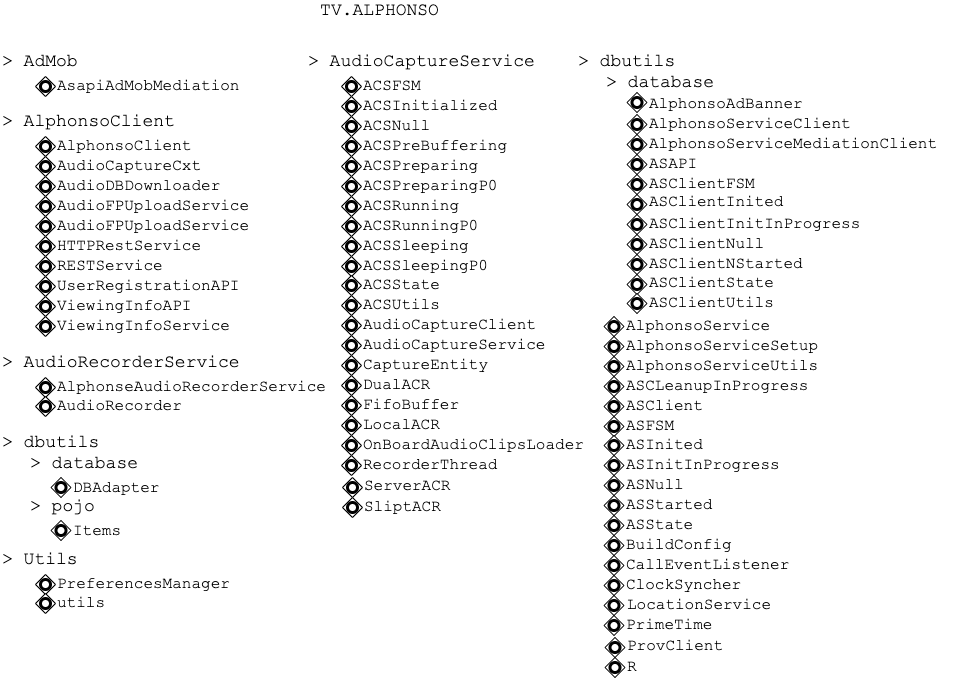
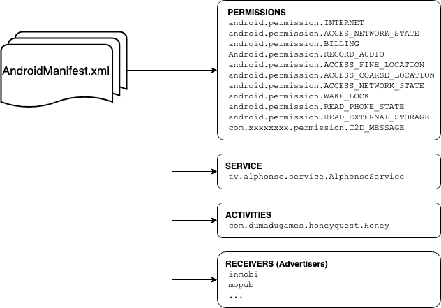
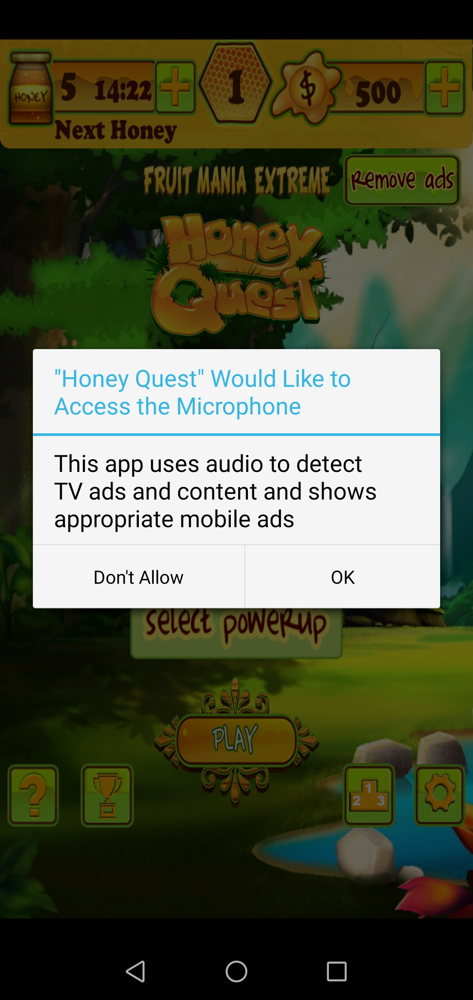
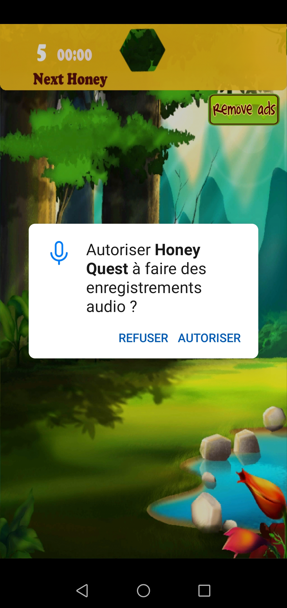
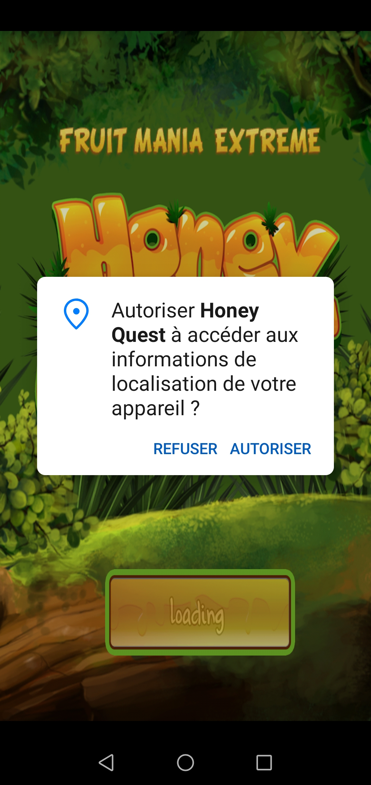
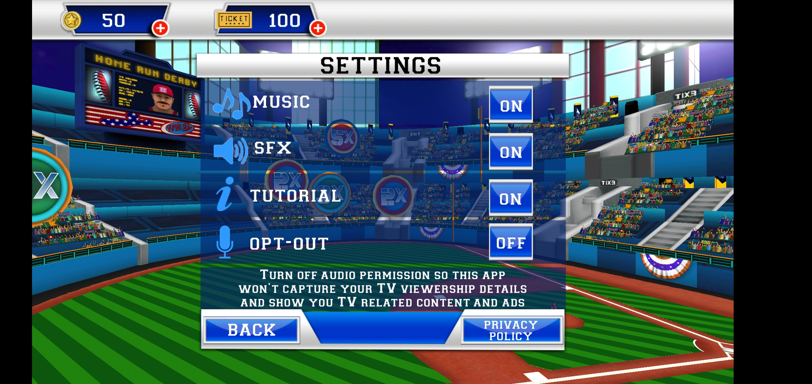
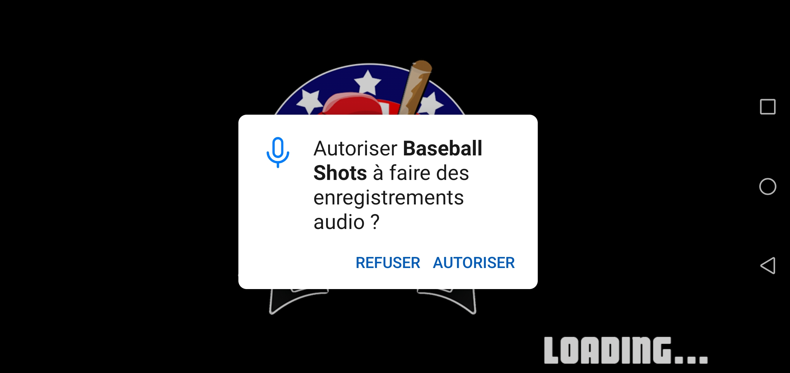
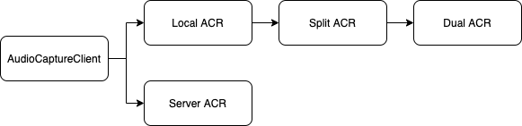

# 


# Analysis of an Eavesdropping application, for Cross-Device Tracking: ALPHONSO SOFTWARE

<br/>

<br/>

<br/>

<br/>


## Presentation of Alphonso Software

Alphonso is an Indian company aiming to enhance advertising on TV. They use a large TV data set to create targeted advertising to users behing their TV. Among others, they implemented one of their technology in basic Smartphone Games, called Automated Content Recognition (ACR). Even if they look like very common games, these applications record what the user is watching on TV and plays back Advertisements related to what they watch.

<br/>

These kinds of applications are yet considered as legal. Indeed the applications warm the user about the fact the TV content they watch is being recorded and that the advertising is targeted. They also rely on the fact that it is possible to remove Audio Permissions in order to avoid being listened. 

However, in 2017, while hundreds of video games were available on the Google PlayStore and the Apple AppStore, the deeds of the company got caught. Many of these third-party applications, using Alphonso ACR,  got removed from the applications stores or updated to a cleaner version. 

<br/>

Some of these applications, as well as their older versions using ACR, can still be found on Application Stores. The analysis of this Software is based on 7 applications from various editors. It has been possible to retrieve the previous versions of the applications, at the time they were implementing ACR, on [apkpure](https://apkpure.com/).  

Below is the list of applications, as well as their editors, their versions and their publication date when they were using ACR. Most of them still maintained  on Google Playstore or available on third-party application stores.

| Name                                 | Editor                  | Versions with ACR                         | Link                                                         |
| ------------------------------------ | ----------------------- | ----------------------------------------- | ------------------------------------------------------------ |
| **Baseball Shots**                   | Augmented Reality Games | v1.0.4 (21/06/2017)                       | [apkpure](https://apkpure.com/baseball-slugfest-mspo-edition/com.augmentedreality.gp.baseballslugfestmsportsedition) |
| **Basketball 3D**                    | Chameleo Studio         | v2.1 (21/10/2016)                         | [apkpure](https://apkpure.com/basketball-3d/com.dumadugames.basketball) |
| **Slog Cricket**                     | Chameleo Studio         | v1.3 (20/06/2017) - v1.4 (15/08/2017)     | [apkpure](https://apkpure.com/slog-cricket/com.dumadugames.gp.slogcricket), [google](https://play.google.com/store/apps/details?id=com.dumadugames.gp.slogcricket) |
| **Impossible Escape 3D**             | Dumadu Games            |                                           |                                                              |
| **Extreme Racing with Beats** **3D** | Dumadu Games            | v1.3 (16/12/2017)                         | [google](https://play.google.com/store/apps/details?id=com.dumadugames.extremeracing) |
| **Slot Machine +**                   | Apostek Software LLP    | v9.1.4 (25/10/2016) - v9.1.5 (21/12/2016) | [apkpure](https://apkpure.com/slot-machine-free-casino/com.apostek.SlotMachine), [google](https://play.google.com/store/apps/details?id=com.apostek.SlotMachine) |
| **Honey Quest**                      | Dumadu Games            | v1.7 (29/07/2017)                         | [apkpure](https://apkpure.com/honey-quest/com.dumadugames.honeyquest) |

<br/>

<br/>

<br/>

## Architecture of the APK

The applications have been downloaded on **apkpure**, as it provides older versions and as current versions of these applications on the Playstore do not use Alphonso ACR anymore.  Using the tool **jadx** and **apktool** enabled a first disassembly of the application.

<br/>

All 7 of the applications are built in a similar fashion. They are first composed of multiple similar packages along with the main package. 

<br/>Some of them (*dagger*, *javax.inject*, *bitter.jnibridge*) are used for Dependency Injection and Code Execution from other languages for Java/Android. Indeed the content of game itself is not present inside the Android application, but inside various library files. 

These library files are 32-bit ELD files compiled for ARM:

- `libunity.so`: 15.4 mB
- `libmono.so`: 3.8 mB
- `linmain.so`: 37 kB

The most important one is `libunity.so`, which has been built on Unity, a video game engine. The Jave Native Interface from the package *bitter.jnibridge* enables to execute Unity language files inside the APK.

These packages and libraries will be out-of-scope for the rest of this analysis.

<br/>

Other packages are used to provide Advertising:

-  *com.inmobi*
- *com.jirbo.adcolony*
- *com.mopub* ...

These advertisement packages will be discussed later.

<br/>

Last, one package retains our attention. This package called `tv.alphonso` is exactly the same for all applications, and contains the content of Alphonso ACR software. It is composed of seven sub-packages, each of them responsible for different part of the process.:

- AdMob
- AlphonsoClient
- AudioRecorderService
- dbutils
- Utils
- AudioCaptureService
- service




<br/>

<br/>

It is also possible to analyze the manifest file to give a bigger picture of the application. The `AndroidManifest.xml` file has been retrieved using **apktool**. 

Among others, we can see the different permissions requested by the game as well as the structure of the application. 

<br/>

A minimal set of permission can be found in every application, even from different editors: 

```java
<uses-permission android:name="android.permission.INTERNET"/>
<uses-permission android:name="android.permission.ACCESS_NETWORK_STATE"/>
<uses-permission android:name="android.permission.RECORD_AUDIO"/>
<uses-permission android:name="android.permission.ACCESS_FINE_LOCATION"/>
<uses-permission android:name="android.permission.ACCESS_COARSE_LOCATION"/>
<uses-permission android:name="android.permission.WRITE_EXTERNAL_STORAGE"/>    
<uses-permission android:name="android.permission.WAKE_LOCK"/>
<uses-permission android:name="android.permission.READ_PHONE_STATE"/>
<uses-permission android:name="android.permission.READ_EXTERNAL_STORAGE"/>
<uses-permission android:name="com.xxxxx.xxxxx.permission.C2D_MESSAGE"/>
```

Other permissions, such as `android.permission.ACCESS_WIFI_STATE`, `android.permission.RECEIVE_BOOT_COMPLETED`, `android.permission.GET_TASKS` are present on some applications but do not seem to be mandatory for Alphonso Software. 

<br/> Most of the applications also implement a Broadcast Receiver from InMobi advertising (`com.inmobi.commons.core. utilities.uid.ImIdShareBroadCastReceiver`).

<br/>

Last, every application implements a Service called `tv.alphonso.service.AlphonsoService`. This service is setup at the application launch and is responsible for the ACR.

```java
<service android:name="tv.alphonso.service.AlphonsoService"android:process="tv.alphonso.service">
				<intent-filter>
        				<action android:name="tv.alphonso.service.AlphonsoService"/>
        </intent-filter>
</service>
```

<br/>

<br/>



<br/>

<br/>

<br/>

## Setup of Alphonso Service

It is the role of the main package to setup and run Alphonso Service. All the interaction between the main package and `tv.alphonso` package is done through the class `tv.alphonso.service.client.ASAPI`, which is in other words the *API* for *Alphonso Service*. 

Alphonso Service will not be launched until the **Audio Recording** and **Location** permissions are granted by the user. The application transparently requests the user to grant these permissions: 

- *"AlphonsoService cannot be instantiated without microphone permissions"*
- *"This app uses audio to detect TV ads and content and shows appropriate mobile ads"*
- *"This App Would Like to Access the Microphone"*

```java
private static boolean checkPermission_RecordAudio() {
 	if (ContextCompat.checkSelfPermission(activity, "android.permission.RECORD_AUDIO") == 0) {
  	return true;
  }	
    return false;
}
```

```java
public void requestMicPermission() {
        if (!checkPermission_RecordAudio()) {
            ActivityCompat.requestPermissions(activity, new String[] {"android.permission.RECORD_AUDIO"}, 1);
        }
    }
```

In case the user does not want to grant these permissions or wants to stop the ACR, the application indicates where to remove these permissions:

```java
toastMsg = "To revoke microphone permission fully kindly go to Settings-->Apps-->" + getString(R.string.app_name) + "—>Permissions-->Microphone (Disable).";
```















<br/>

When the Audio and Location permission are granted, the Service is initialized by calling the function `init` from the Alphonso Service API, that then calls other functions from the different classes of the package `tv.alphonso`. 

```java
if (checkPermission_RecordAudio()) {
		if (this.sharedpreferences.getBoolean(KEY_OPTOUT_CLICK, false)) {
				setupAlphonsoService();
    } else if (alphonsServiceInitialized) {
    		stopAlphonsoService();
    } else {
    		setOptoutOption(true);
    }
}
```

```java
public void setupAlphonsoService() {
        if (!this.alphonsoFlag) {
            try {
                String API_KEY = getString(R.string.alphonso_key_playstore);
                ASAPI.init(API_KEY, this, getResultReceiver(), true);
                this.alphonsoFlag = true;
                Log.e("alphonso", "Key used" + API_KEY);
            } catch (Exception e) {
                Log.e("callback", "Exception: " + e);
                e.printStackTrace();
            }
        } else {
            Toast.makeText(this, "iniatialization inprogress", 0).show();
        }
    }
```

<br/>

<br/>

A communication between a server and the application is initiated during the initilization of the service. This server will be at the origin of the Automated Content Recognition software, and will be discussed in the later sections. 

In order to follow the initialization steps of the application, it is a good idea to follow this communication between the server and the client.


#### Dynamic Analysis of the Initialization between the server and the client

We use Burp Suite proxy in order to capture the traffic between the server and the client. 

First of, we create a listener on a Burp Suite proxy. This listener is meant to capture all the traffic going through the proxy so that it is possible to analyze it. Then, we connect the Android phone running the App to this proxy and certify the proxy as genuine by adding Burp certificate. 

We can then launch the application to observe what dialog is initiated at launch. 

<br/>

Two hosts are contacted by the application when launched: `api.alphonso.tv:4430` and `prov.alphonso.tv:4000`.

The client uses two unique identifiers to communicate with these hosts: a UID and an API Key. The API Key authenticates the client to the server, and is composed of the identifier of the application and of a unique identifier corresponding to the user (for instance: *D-HoneyQuest-A-TsrtBebik2w4wfIu*,  *D-SlogCrkt-A-j82ZaR5HnNiBfbNa*). 

```http
POST /v2/user/lookups?alp_uid=100&api_key=D-SlogCrkt-A-j82ZaR5HnNiBfbNa HTTP/1.1
Connection: close
Content-Type: application/json
User-Agent: Dalvik/2.1.0 (Linux; U; Android 9; ANE-LX1 Build/HUAWEIANE-L01)
Host: api.alphonso.tv:4430
Accept-Encoding: gzip, deflate
Content-Length: 69
{
"device_id":"d94135ce-cff6-4d35-98ab-f830023b73de",
"long_poll":true
}
```

These identifiers are used every time the client wants to query and push data to the server. Below is the same baheviour for another kind of HTTP request (when querying audio clip data from the server), using the same identifiers.

```java
uri.append(getAlphonsoServerUrl());
uri.append("/user/audio_clip_data");
uri.append(getAlphonsoUidSuffix(true));    // getAlphonsoUidSuffix(true) outputs a string equal to "?alp_uid=[alphonso_uid]"
if (this.mApiKey != null) {
  uri.append("&api_key=" + this.mApiKey);  // mApiKey equal to appId, equal to "D-SlogCrkt-A-j82ZaR5HnNiBfbNa" here
}
```


<br/>

After a configuration request and a location update is being sent to the two servers, the client loops on the same POST request to `api.alphonso.tv:4430/v2/user/lookups`. No other type of request is seen later, showing a wrong behaviour of the running applications.


It is possible to look at the **logs** of the application to see what caused this loop. The logs of the application can be retrieved using **adb** **logcat**. As we can see below, the service is well initiated:

- The user has granted Location and Microphone permissions

``` 
29381 29381 E callback: Location Permission granted
29381 29381 E callback: Mic Permission granted
```

- The `appId` is initialized

```
29381 29381 D tv.alphonso.service.client.AlphonsoServiceClient: appId: D-HoneyQuest-A-TsrtBebik2w4wfIuappname: Honey Quest
29381 29381 D tv.alphonso.service.client.ASClientFSM: Processing INIT event in tv.alphonso.service.client.ASClientNull state.
29381 29381 D tv.alphonso.utils.Utils: AppInfo in not null, name: .Honey Quest
29381 29381 D tv.alphonso.utils.Utils: label has only app-name.
29381 29381 E alphonso: Key usedD-HoneyQuest-A-TsrtBebik2w4wfIu
```

- Alphonso service is started and initialized

```
29740 29740 D tv.alphonso.service.AlphonsoService: onCreate
29740 29753 I AwareBitmapCacher: init processName:tv.alphonso.service pid=29740 uid=10158
29740 29740 D tv.alphonso.service.AlphonsoService: onBind()
29381 29381 D tv.alphonso.service.client.ASClientFSM: Processing SERVICE_CONNECTION_UP event in tv.alphonso.service.client.ASClientInitInProgress state.
29381 29381 D tv.alphonso.service.client.ASClientInitInProgress: AlphonsoService connected!
29381 29381 D tv.alphonso.service.client.ASClientInitInProgress: Sending INIT message to AlphonsoService.
```

- Alphonso server domain is set

```
29740 29740 D tv.alphonso.alphonsoclient.AlphonsoClient: Alphonso Server Domain set as: http://api.alphonso.tv
29740 29740 D tv.alphonso.alphonsoclient.AlphonsoClient: Alphonso Server Port set as: 4430
29740 29740 D tv.alphonso.alphonsoclient.AlphonsoClient: Alphonso Server Domain SSL set as: 
29740 29740 D tv.alphonso.alphonsoclient.AlphonsoClient: Alphonso Server Port SSL set as: 
29740 29761 D tv.alphonso.alphonsoclient.AlphonsoClient: Alphonso Prov Server Domain set as: http://prov.alphonso.tv
29740 29761 D tv.alphonso.alphonsoclient.AlphonsoClient: Alphonso Prov Server Port set as: 4000
```

However, the initialization fails as the client does not manage to reach the host `api.alphonso.tv`:

```
15405 15629 E tv.alphonso.alphonsoclient.RESTService: There was a problem when sending the request.
15405 15629 E tv.alphonso.alphonsoclient.RESTService: org.apache.http.conn.HttpHostConnectException: Connection to http://api.alphonso.tv:4430 refused
.......
.......
15405 15629 E tv.alphonso.alphonsoclient.RESTService: Caused by: java.net.ConnectException: failed to connect to /209.240.97.254 (port 4430) from /:: (port 33712): connect failed: ECONNREFUSED (Connection refused)
.......
.......
15501 15501 D tv.alphonso.service.client.ASClientUtils: Sending START message to AlphonsoService.
15405 15632 E tv.alphonso.alphonsoclient.HttpRestService: HTTP SocketException, no presponse from server.
15405 15632 E tv.alphonso.alphonsoclient.ViewingInfoAPI: REST API Call to server failed. HTTP code: 1002
15405 15405 E tv.alphonso.service.AlphonsoService: Error response is with error code: 1
```

The service is not totally initalized as the connection is not established. The servers most probably went down, and cannot be reached anymore. 


<br/>

<br/>

<br/>

## Audio Recording

The recording of the Audio is done by the package `AudioRecorderService`. 

Alphonso uses the **android library** `android.media.AudioRecord` for recording audio (https://developer.android.com/reference/android/media/AudioRecord)

The class `AlphonsoAudioRecorderService` calls the class `AudioRecorder`, which is a basic implementation of the android library. 

<br/>

The entire service is called by the `Recorder Thread` from the package **`AudioCaptureService`** (see below). 

<br/>

<br/>

<br/>

## ACR: Automated Content Recognition  

The treatement of the Audio samples is done by the package `AudioCaptureService`. 

The APK uses 4 methods of computation for the ACR:

- Local ACR
- Server ACR
- Split ACR
- Dual ACR

**Local ACR** is probably the most interesting computation method. Contrary to the 3 other methods of computation, this method does not communicate with the server. It generates a **fingerprint** of the Audio Clips that identifies features of the Audio. 

**Server ACR:** Sends the entire Audio Clip to the server. Retrieves later the Clip Data by querying the server about its results. 

**Split ACR:** Computes the **fingerprint** and sends it to the server.

**Dual ACR:** Both computes locally and sends the Audio Clip to the server.

```java

public void enableAcr(int acrMode) {
  AudioCaptureClient captureClient;
  if (this.mRecorderThread != null) {
    switch (acrMode) {
      case 1:
        captureClient = new LocalACR();
        break;
      case 2:
        captureClient = new SplitACR();
        break;
      case 4:
        captureClient = new DualACR();
        break;
      case 8:
        captureClient = new ServerACR();
        break;
....
}
```



<br/>

#### Analysis of Local ACR

The local ACR computation method uses native code to compute the fingerprints of the Audio samples. It sends to raw audio data to the native libary called `libacr.so` present in the apk. 

.### To complete with native file disassembly 

A function in the Local ACR class, called `uploadAudioFileIfRequired` remains of interest. It uploads the raw files locally, on the device, at a particular place. The Raw audio files can therefore be saved on the device.

```java
params.putString("filename", getOnBoardAudioDBFileDir() + "/" + this.mLocalAudioMatchingToken[this.mCurrentTokenIndex] + ".audio.raw");
```

When looking at the storage, nothing is found as the initialization couldn't be completed. 

<br/>

<br/>

<br/>

#### Communication with the server (Server and Split ACR)

When using a different ACR computation method than the Local one, data is sent to the server for computation. 

In the case of Split ACR, the fingerprint is computed by the same native code than previously. However the Fingerprint is uploaded to the server in order to be computed as Audio Data, using the class `AudioFPUploadService`. 


<br/>

<br/>

<br/>

## Audio Clip Data

After the ACR being done, either the client has locally retrieved some Data about the audio clip, either it queries the server about the audio/fingerprint it uploaded (GET query at `api.alphonso.tv/user/audio_clip_data`). The main package implements a *result receiver* that is initialized with Alphonso Service. This result receiver awaits for audio clip data to arrive from the service. 

```java
private ResultReceiver getIdentificationsReceiver() {
        if (this.mIdentificationReceiver == null) {
            this.mIdentificationReceiver = new ResultReceiver(new Handler()) {
                /* access modifiers changed from: protected */
                public void onReceiveResult(int resultCode, Bundle resultData) {
                    if (resultCode == 0) {
                        Log.e("callback", "title: " + resultData.getString("title"));
                        Log.e("callback", "date: " + resultData.getString("date"));
                        Log.e("callback", "time: " + resultData.getString("time"));
                        StringBuffer buf = new StringBuffer();
                        if (resultData.getString("type").equals("commercial")) {
                            buf.append("Title: ");
                            buf.append(resultData.getString("title") + "\n");
                            Log.e("callback", "brand: " + resultData.getString("brand"));
                            buf.append("Brand: ");
                            buf.append(resultData.getString("brand") + "\n");
                            if (resultData.containsKey("match_offset")) {
                                Log.e("callback", "Match-Offset: " + resultData.getLong("match_offset"));
                                buf.append("Match-Offset: ");
                                buf.append(resultData.getLong("match_offset") + "ms\n");
                            }
                        } else if (resultData.getString("type").equals("livetv")) {
                            buf.append("Title: ");
                            buf.append(resultData.getString("title") + "\n");
                            if (resultData.containsKey("network")) {
                                Log.e("callback", "Network: " + resultData.getString("network"));
                                buf.append("Network: ");
                                buf.append(resultData.getString("network") + "\n");
                            }
                            Log.e("callback", "Channel: " + resultData.getString("channel"));
                            buf.append("Channel: ");
                            buf.append(resultData.getString("channel") + "\n");
                            if (resultData.containsKey("tms_info")) {
                                Log.e("callback", "tms_info: " + resultData.getString("tms_info"));
                                try {
                                    JSONObject jObj = new JSONObject(resultData.getString("tms_info"));
                                    if (jObj.has("seasonNum")) {
                                        Log.e("callback", "Season : " + jObj.getInt("seasonNum"));
                                        buf.append("Season : ");
                                        buf.append(jObj.getInt("seasonNum") + "\n");
                                    }
                                    if (jObj.has("episodeNum")) {
                                        Log.e("callback", "Episode : " + jObj.getInt("episodeNum"));
                                        buf.append("Episode : ");
                                        buf.append(jObj.getInt("episodeNum") + "\n");
                                    }
                                    if (jObj.has("episodeTitle")) {
                                        Log.e("callback", "Episode Title: " + jObj.getString("episodeTitle"));
                                        buf.append("Episode Title: ");
                                        buf.append(jObj.getString("episodeTitle") + "\n");
                                    }
                                } catch (JSONException e) {
                                    e.printStackTrace();
                                }
                            }
                            if (resultData.containsKey("match_offset")) {
                                Log.e("callback", "Match-Offset: " + resultData.getLong("match_offset"));
                                buf.append("Match-Offset: ");
                                buf.append(resultData.getLong("match_offset") + "ms\n");
                            }
                            if (resultData.containsKey("live_feed_offset")) {
                                Log.e("callback", "Live-Feed-Offset: " + resultData.getLong("live_feed_offset"));
                                buf.append("Live-Feed-Offset: ");
                                buf.append(resultData.getLong("live_feed_offset") + "ms\n");
                            }
                        }
                    }
                }
            };
        }
        return this.mIdentificationReceiver;
    }
```

The audio clip data can give information whether the user is watching a **Commercial** or a **Live TV program**. Even more, Alphonso Software enables to distinguish which brand and product is being advertized on the user's TV, on which channel and network the user is, what episode and season of Live TV the user is watching ...

- Title 
- Date 
- Time 
- COMMERCIAL 
  - Title
  - Brand
- LIVE TV
  - Title
  - Network
  - Channel
  - TMS Info
    - Season Number
    - Episode number
    - Episode Title

<br/>

<br/>

<br/>


## Performance Enchancement

Even if it is able to record on the background, the application does not permanently capture the audio. As the main aim of Alphonso is to listen to TV and to find what the user is watching, the application only records under certain conditions in order to maximize the share of useful captures and minimize battery and CPU usage. 

<br/>

First of, the application uses the permissions `READ_PHONE_STATE`, `ACCESS_NETWORK_STATE` and sometimes `RECEIVE_BOOT_COMPLETED`. This three dangerous permissions are a good indicator that the application can know when the phone is being used by the user.

<br/>

The class `tv.alphonso.utils.Utils` also shows that the location of the user, regularly sent to the server, is more exhaustive as it includes the **bearing** and **speed** of the device. These two information are sufficient to know whether the user is looking at their phone screen. 

```java
locBundle.put("latitude", Double.valueOf(loc.getLatitude()));
locBundle.put("longitude", Double.valueOf(loc.getLongitude()));
if (loc.hasAltitude()) {locBundle.put("altitude", Double.valueOf(loc.getAltitude()));}
if (loc.hasSpeed()) {locBundle.put("speed", Float.valueOf(loc.getSpeed()));}
if (loc.hasBearing()) {locBundle.put("bearing", Float.valueOf(loc.getBearing()));}
if (!loc.hasAccuracy()) {return locBundle;}
locBundle.put("accuracy", Float.valueOf(loc.getAccuracy()));
```

<br/>

Different signals are also hooked by the application: `USER_PRESENT`, `SCREEN_OFF`,`HEADSET_PLUG`,`USB_STATE`. It once again shows the capacity of the app to know when the user is on their phone (most probably during Ads when watching TV), so that it can enhance the chances of capturing useful recording.  

<br/>

Many of the classes of the package `audiocaptureservice` are implented to modify the behaviour of the application under certain circonstances. Different parameters can be modified on the go (Capture Duration, Count, Sleep Interval, Sleep time) with a function for each parameter modification: 

```java
public void setCaptureDuration(long mCaptureDuration2) {...}
public void setCaptureCount(int mCaptureCount2) {...}
public void setCaptureScenarioCount(int mCaptureScenarioCount2) {...}
public void setCaptureScenarioSleepInterval(long mCaptureScenarioSleepInterval2) {...}
public void setCaptureScenarioSleepIntervaLivetv(long mCaptureScenarioSleepIntervalLivetv2) {...}
public void setCaptureSleepTime(long mCaptureSleepTime2) {...}
public void setPowerOptimizationMode(boolean flag) {...}
```

The application is able to modify the interval, the duration, the number of recording being captured. These modifications are trigered depending on the previous results, if the last audio clip showed that the user was watching Adverts or live TV for instance. This can also be modified by a function of `tv.alphonso.audiocaptureservice.ACSSleepingPO` called `onPrimeTimeBegin()`. This function will modify the behaviour of the recordings when the user is most likely to watch TV, i.e. during Prime Times on TV. 

<br/>

The default values of these parameters can be retrieved inside the class `tv.alphonso.utils.PreferencesManager`, as well as functions called by the previous classes to modify these default values.

```java
# Prime Time hours
public static final String ACS_EVENING_PRIME_TIME_BEGIN_DEFAULT = "19:00";
public static final String ACS_EVENING_PRIME_TIME_END_DEFAULT = "22:00";
public static final String ACS_MORNING_PRIME_TIME_BEGIN_DEFAULT = "06:00";
public static final String ACS_MORNING_PRIME_TIME_END_DEFAULT = "09:00";

# Audio Capture parameters
public static final long ACS_CAPTURE_DURATION_DEFAULT = 5;
public static final long ACS_CAPTURE_DURATION_MS_DEFAULT = 5000;
public static final long ACS_CAPTURE_PREPARE_TIME_DEFAULT = 400;
public static final int ACS_CAPTURE_SCENARIO_COUNT_DEFAULT = 0;
public static final long ACS_CAPTURE_SCENARIO_SLEEP_INTERVAL_DEFAULT = 0;
public static final long ACS_CAPTURE_SCENARIO_SLEEP_INTERVAL_LIVETV_MATCH_DEFAULT = 12;
public static final long ACS_CAPTURE_SCENARIO_SLEEP_INTERVAL_MAX_DEFAULT = 1200;
public static final long ACS_CAPTURE_SLEEP_TIME_DEFAULT = 10;
```

<br/>

.## TODO: History Database

<br/>

<br/>

<br/>


## XDT: Cross Device Tracking

The aim of Alphonso Software is to recognize what the user is watching on TV, in order to display target adverts on the user's phone. This technique is called **Cross Device Tracking** as it links two user's devices.

Different advertisers are providing these targeted adverts in the application: **inmobi**, **jirbo.adcolony**, **mopub**, **vungle**... 

<br/>

<br/>

<br/>

## VirusTotal Detection

Although it is a "legal" eavesdropping application, the apks are detected by different antiviruses as malicious. 

|                 | Sophos: Android Privacy Risk Alphonso (PUA) | ESET-NOD32: Android/Inmobi.C | Ikarus: PUA.AndroidOS.Inmobi | Symantec: AdLibrary:MoPub | Fortinet: Adware/AdColony!Android | CAT_QuickHeal: Android.RiskCAD.A (PUP) |
| --------------- | ------------------------------------------- | ---------------------------- | ---------------------------- | ------------------------- | --------------------------------- | -------------------------------------- |
| Basketball 3D   | X                                           |                              |                              |                           |                                   |                                        |
| Slot Machine +  | X                                           | X                            | X                            |                           |                                   |                                        |
| HoneyQuest      | X                                           |                              |                              |                           |                                   |                                        |
| Baseball Strike | X                                           |                              |                              | X                         | X                                 |                                        |
| Extreme Racing  | X                                           |                              |                              |                           |                                   | X                                      |
| Slog Cricket    | X                                           |                              |                              | X                         | X                                 |                                        |

The antiviruses spotlight the dangerous permissions and signal hooks used by the applications, as well as Advertisers and URLs considered as malicious. 