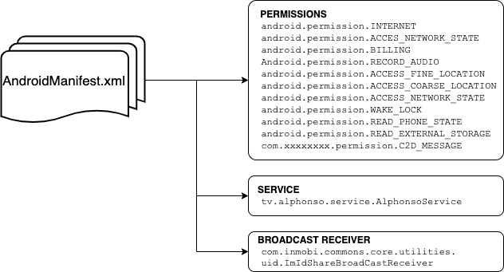
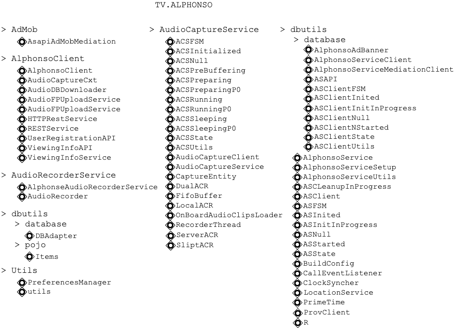

# 

<br/>


# ALPHONSO SOFTWARE 

<br/>

<br/>


## Known applications still on the Market

- Baseball shots (com.augmentedreality.gp.baseball) - Augmented Reality Games
  https://apkpure.com/baseball-slugfest-mspo-edition/com.augmentedreality.gp.baseballslugfestmsportsedition

- Basketball 3D (com.dumadugames.basketball.apk) - Dumadu Games / Chameleo Studio
  https://apkpure.com/basketball-3d/com.dumadugames.basketball

- Slog Cricket (com.dumadugames.gp.slogcricket ) - Dumadu Games / Chameleo Studio
  https://apkpure.com/slog-cricket/com.dumadugames.gp.slogcricket

- Impossible Escape 3D (Dumandu Games)

- Slot Machine+ (com.apostek.SlotMachine) - Apostek Software LLP
  https://apkpure.com/slot-machine-free-casino/com.apostek.SlotMachine

- Extreme Racing with Beats 3D (com.dumadugames.extremeracing) - Dumadu Games
  https://play.google.com/store/apps/details?id=com.dumadugames.extremeracing&hl=fr&gl=US

- Stunt Biker Extreme Trials (Dumadu Games)

- Honey Quest (com.dumadugames.honeyquest) - Dumadu Games
  https://apkpure.com/honey-quest/com.dumadugames.honeyquest

  


<br/>

<br/>

<br/>


## VirusTotal detection

Detected as `Android Privacy Risk Alphonso (PUA)` by Sophos.

Detected as `PUA.AndroidOS.Inmobi` by Ikarus (depends on the advertisers used).

Detected as `AdLibrary:MoPub` by Symantec  (depends on the advertisers used).

Detected as `Adware/AdColony!Android` by Fortinet  (depends on the advertisers used).


<br/>

<br/>

<br/>


## `AndroidManifest.xml` Categorization

All the applications using Alphonso Software share an equivalent set of permissions.
Also they all possess the same **Alphonso service**.





**Minimal set of permissions**

```java
<uses-permission android:name="android.permission.INTERNET"/>
<uses-permission android:name="android.permission.ACCESS_NETWORK_STATE"/>
<uses-permission android:name="com.android.vending.BILLING"/>
<uses-permission android:name="android.permission.RECORD_AUDIO"/>
<uses-permission android:name="android.permission.ACCESS_FINE_LOCATION"/>
<uses-permission android:name="android.permission.ACCESS_COARSE_LOCATION"/>
<uses-permission android:name="android.permission.INTERNET"/> 									(2nd time)
<uses-permission android:name="android.permission.WRITE_EXTERNAL_STORAGE"/>     (2nd time)
<uses-permission android:name="android.permission.ACCESS_NETWORK_STATE"/>
<uses-permission android:name="android.permission.WAKE_LOCK"/>
<uses-permission android:name="android.permission.READ_PHONE_STATE"/>
<uses-permission android:name="android.permission.READ_EXTERNAL_STORAGE"/>
<uses-permission android:name="com.google.android.c2dm.permission.RECEIVE"/>
<uses-permission android:name="com.dumadugames.xxxxxxxxxx.permission.C2D_MESSAGE"/>
```

**Additional permisions**

```java
<uses-permission android:name="android.permission.VIBRATE"/>
<uses-permission android:name="com.samsung.android.providers.context.permission. WRITE_USE_APP_FEATURE_SURVEY"/>
<uses-permission android:name="android.permission.ACCESS_WIFI_STATE"/>
<uses-permission android:name="android.permission.RECEIVE_BOOT_COMPLETED"/>
<uses-permission android:name="android.permission.GET_TASKS"/>      
```

**Alphonso Service**

```Java
<service android:name="tv.alphonso.service.AlphonsoService"android:process="tv.alphonso.service">
				<intent-filter>
        				<action android:name="tv.alphonso.service.AlphonsoService"/>
        </intent-filter>
</service>
```


**InMobi Broadcast Receiver**

```Java
<receiver android:name="com.inmobi.commons.core.utilities.uid.ImIdShareBroadCastReceiver" android:enabled="true" android:exported="true">
          <intent-filter>
                <action android:name="com.inmobi.share.id"/>
          </intent-filter>
</receiver>
```


<br/>

<br/>

<br/>


## `tv.alphonso` Package

This library is responsible to the capture of the Audio and the translation the audio into the watched TV Ad or TV Show.





<br/>

### AudioCaptureService

**Class** and **object** `AudioCaptureService`.

This class is the setting point of the capture:

- Capture duration
- Capture count
- Capture scenario count
- Capture scenario sleep interval
- mCapture scenario sleep interval Live TV
- Capture Scnario sleep interval max
- Capture sleep time
- History flag
- Power optimization mode

<br/>


Both **local** and **server-side** computation ? Also **split** apparently ?

```Java
this.localAcrStats = new String[]{"Total Matches", "Min Match Time", "Max Match Time", "Avg Match Time"};
this.serverAcrStats = new String[]{"Total Matches", "Min Match Time", "Max Match Time", "Avg Match Time"};
```

<br/>


**ACSRunning**
onResult() 

```Java
public void onResult(AudioCaptureService acsInstance, Bundle resultData) {
        if (acsInstance.mCaptureScenarioCount != 0 || acsInstance.mCaptureCount != 0) {
            if (!resultData.containsKey("title")) {
                Log.e(TAG, "Received result with no title, ignoring result..");
                return;
            }
            acsInstance.mCaptureInstance.setCaptureTitle(resultData.getString("title"));
            if (resultData.getString("type").equals("commercial")) {
                acsInstance.mCaptureInstance.mBrand = resultData.getString("brand");
            } else if (resultData.getString("type").equals("livetv")) {
                acsInstance.mCaptureInstance.mBrand = resultData.getString("network");
            }
            acsInstance.mCaptureInstance.setEndTime(resultData.getLong("timestamp"));
            acsInstance.mCaptureInstance.setAcrType(resultData.getString("acr_type"));
            processCaptureResult(acsInstance, (byte) 0, resultData.getString("type"), false);
        }
    }
```


<br/>

**LocalACR**
Extension of AudioCaptureClient

# >>> FINISH THE PART ON THE CAPTURE SERVICE

