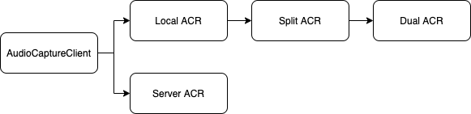

# 

<br/>


# ALPHONSO SOFTWARE 

<br/>

<br/>


## Known applications still on the Market

- Baseball shots (com.augmentedreality.gp.baseball) - Augmented Reality Games
  https://apkpure.com/baseball-slugfest-mspo-edition/com.augmentedreality.gp.baseballslugfestmsportsedition

- Basketball 3D (com.dumadugames.basketball.apk) - Dumadu Games / Chameleo Studio
  https://apkpure.com/basketball-3d/com.dumadugames.basketball

- Slog Cricket (com.dumadugames.gp.slogcricket ) - Dumadu Games / Chameleo Studio
  https://apkpure.com/slog-cricket/com.dumadugames.gp.slogcricket

- Impossible Escape 3D (Dumandu Games)

- Slot Machine+ (com.apostek.SlotMachine) - Apostek Software LLP
  https://apkpure.com/slot-machine-free-casino/com.apostek.SlotMachine

- Extreme Racing with Beats 3D (com.dumadugames.extremeracing) - Dumadu Games
  https://play.google.com/store/apps/details?id=com.dumadugames.extremeracing&hl=fr&gl=US

- Stunt Biker Extreme Trials (Dumadu Games)

- Honey Quest (com.dumadugames.honeyquest) - Dumadu Games
  https://apkpure.com/honey-quest/com.dumadugames.honeyquest

  


<br/>

<br/>

<br/>


## VirusTotal detection

Detected as `Android Privacy Risk Alphonso (PUA)` by Sophos.

Detected as `PUA.AndroidOS.Inmobi` by Ikarus (depends on the advertisers used).

Detected as `AdLibrary:MoPub` by Symantec  (depends on the advertisers used).

Detected as `Adware/AdColony!Android` by Fortinet  (depends on the advertisers used).


<br/>

<br/>

<br/>


## `AndroidManifest.xml` Categorization

All the applications using Alphonso Software share an equivalent set of permissions.
Also they all possess the same **Alphonso service**.


**Minimal set of permissions**

```java
<uses-permission android:name="android.permission.INTERNET"/>
<uses-permission android:name="android.permission.ACCESS_NETWORK_STATE"/>
<uses-permission android:name="com.android.vending.BILLING"/>
<uses-permission android:name="android.permission.RECORD_AUDIO"/>
<uses-permission android:name="android.permission.ACCESS_FINE_LOCATION"/>
<uses-permission android:name="android.permission.ACCESS_COARSE_LOCATION"/>
<uses-permission android:name="android.permission.INTERNET"/> 									(2nd time)
<uses-permission android:name="android.permission.WRITE_EXTERNAL_STORAGE"/>     (2nd time)
<uses-permission android:name="android.permission.ACCESS_NETWORK_STATE"/>
<uses-permission android:name="android.permission.WAKE_LOCK"/>
<uses-permission android:name="android.permission.READ_PHONE_STATE"/>
<uses-permission android:name="android.permission.READ_EXTERNAL_STORAGE"/>
<uses-permission android:name="com.google.android.c2dm.permission.RECEIVE"/>
<uses-permission android:name="com.dumadugames.xxxxxxxxxx.permission.C2D_MESSAGE"/>
```

**Additional permisions**

```java
<uses-permission android:name="android.permission.VIBRATE"/>
<uses-permission android:name="com.samsung.android.providers.context.permission. WRITE_USE_APP_FEATURE_SURVEY"/>
<uses-permission android:name="android.permission.ACCESS_WIFI_STATE"/>
<uses-permission android:name="android.permission.RECEIVE_BOOT_COMPLETED"/>
<uses-permission android:name="android.permission.GET_TASKS"/>      
```

**Alphonso Service**

```Java
<service android:name="tv.alphonso.service.AlphonsoService"android:process="tv.alphonso.service">
				<intent-filter>
        				<action android:name="tv.alphonso.service.AlphonsoService"/>
        </intent-filter>
</service>
```


**InMobi Broadcast Receiver**

```Java
<receiver android:name="com.inmobi.commons.core.utilities.uid.ImIdShareBroadCastReceiver" android:enabled="true" android:exported="true">
          <intent-filter>
                <action android:name="com.inmobi.share.id"/>
          </intent-filter>
</receiver>
```


<br/>

<br/>

<br/>

## Ask for  permissions

The permissions for the **Microphone** usage and the Location are permanently asked to the user. Custom pop-up requesting for audio permissions (*"AlphonsoService cannot be instantiated without microphone permissions.", "This app uses audio to detect TV ads and content and shows appropriate mobile ads. This app would Like to Access the Microphone"*).

Alphonso Service will be setup after the permissions being granted. 

<br/>

<br/>

<br/>


# RECORD + AUDIO CAPTURE

<br/>

## `tv.alphonso` Package

This library is responsible to the capture of the Audio and the translation the audio into the watched TV Ad or TV Show.


The packages **`AUdioCaptureService`** and **`AudioRecorderService`** are the two packages responsible for the recording and the "capturing" (translation of the audio into Ad) of the audio. 

<br/>

<br/>

<br/>

## Audio Recorder Service

Alphonso uses the **android library** `android.media.AudioRecord` for recording audio (https://developer.android.com/reference/android/media/AudioRecord)

The class **`AlphonsoAudioRecorderService`** calls the class `AudioRecorder`, which is a basic implementation of the android library. 

<br/>

The entire service is called by the **`Recorder Thread`** from the package **`AudioCaptureService`** (see below).

<br/>

<br/>

<br/>

## AudioCaptureService

**Class** and **object** `AudioCaptureService`.

This class is the setting point of the capture:

- Capture duration
- Capture count
- Capture scenario count
- Capture scenario sleep interval
- mCapture scenario sleep interval Live TV
- Capture Scenario sleep interval max
- Capture sleep time
- History flag
- Power optimization mode

It modifies the bahaviour (**duration, interval**) of each recording considering many aspects (if it is **prime time** or not, if the last recoridng gave **no result**, if the last result was a **commercial** or **live TV**...)

<br/>

Both **local** and **server-side** computation ? Also **split** and **dual **apparently

```Java
this.localAcrStats = new String[]{"Total Matches", "Min Match Time", "Max Match Time", "Avg Match Time"};
this.serverAcrStats = new String[]{"Total Matches", "Min Match Time", "Max Match Time", "Avg Match Time"};
```


<br/>

### ACR

ACR = Audio Capture Result
These classes are *most probably* responsible for computing the Audio Recording to a dexciption of what the user is watching on TV.  

There are four different ACR methods: 

- Local ACR
- Server ACR
- Split ACR (extension of Local ACR)
- Dual ACR (extension of Split ACR)



**LocalACR**
Extension of AudioCaptureClient.

Uses *native code*. This native code is used to *fingerprint* the bytes of the audio capture. Maybe this is how the **Text-To Speech** is done. 

Possibility to **upload**  the audio file to the Alphonso Server. This might be called by the Split and Dual ACR methods.

<br/>

**ServerACR**
Sends the Audio File to the Server with the meta-date:

- number of packets sent
- sample rate
- ID of the device
- Starting time
- ID of the capture
- Timestamp
- Capture Time

It uses the service **`mAudioFPUploadService`** from `AlphonsoClient` package to send the samples.

<br/>

**SplitACR**
**Fingerprints** the Audio Capture, and sends only the fingerprint to the Server. 

<br/>

**SplitACR**
Not a lot of Info on Dual ACR. Uses the same computation methods than LocalACR.


# Others

### CallEventListener

Class from the `service/client` package. When the user's phone is **ringing**, when the user **answers the call** or when the user **finishes his call**, the class sends a message to the `AudioCaptureService`


### LocationService

Class from the `service/client` package. The user is permanently located. The location of the user is sent to Alphonso Client, with then sends the lcoation to the server. 